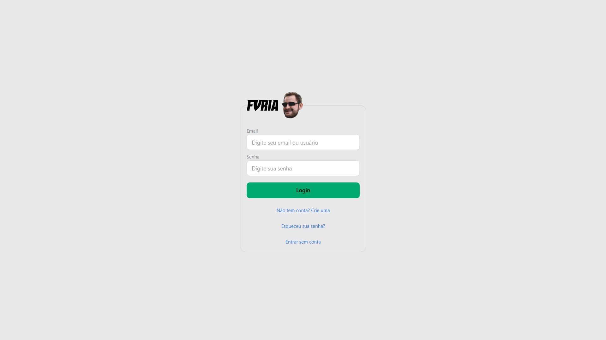
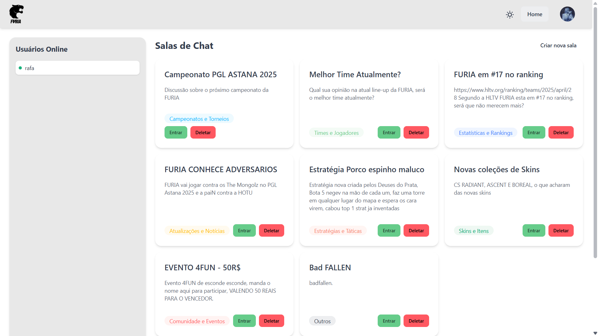
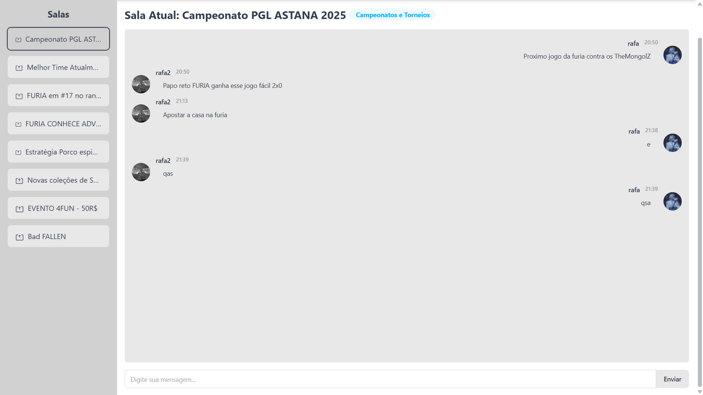
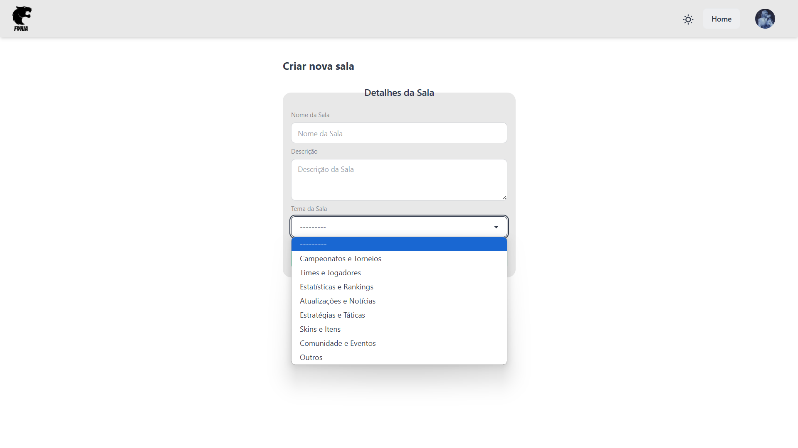
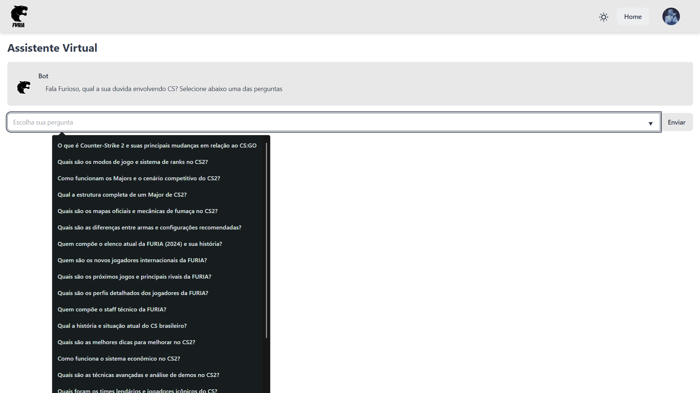
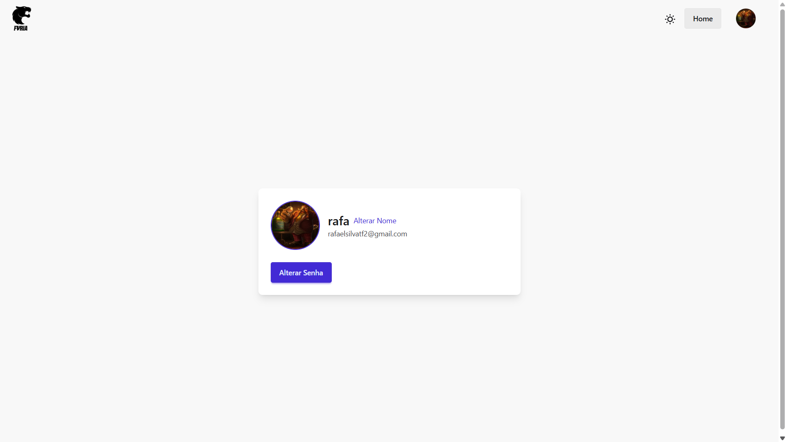

# Furia-ChatRooms

Um sistema de chat para usuários se comunicarem em tempo real e um chat bot para fazerem perguntas relacionadas a Counter Strike. O site é responsivo e funcionara em qualquer dispositivo. O projeto foi desenvolvido utilizando Django, com integração de websockets para mensagens instantâneas.

## Tecnologias Principais usadas

Aqui estão as tecnologias usadas neste projeto:

## Backend
<table>
  <tr>
    <td align="center">
      
      <br />Django
    </td>
    <td align="center">
      
      <br />Python
    </td>
  </tr>
</table>

## Frontend
<table>
  <tr>
    <td align="center">
      
      <br />JavaScript
    </td>
    <td align="center">
      
      <br />HTML5
    </td>
    <td align="center">
      
      <br />CSS3
    </td>
    <td align="center">
      
      <br />Tailwind CSS
    </td>
    <td align="center">
      
      <br />DaisyUI
    </td>
  </tr>
</table>

## Banco de Dados
<table>
  <tr>
    <td align="center">
      
      <br />PostgreSQL
    </td>
  </tr>
</table>


## Imagens do Projeto

[](images/paglogin.png)  
_Tela de login, com criação de conta e restauração de senha._

[](images/pagtela1.png)  
_Cards com as salas e visualizador de usuários online._

[](images/pagchat.png)  
_Página com o chat em tempo real com outros usuários._

[](images/pagcriarchat.png)  
_Criação de cards com nome, descrição e um tema específico para aquela sala._

[](images/pagbot.png)  
_Perguntas predefinidas para o usuário selecionar e o bot irá responder._

[](images/pagperfil.png)
_Pagina para edição de perfil do usuário podendo mudar sua foto de perfil, nome, e alterar sua senha_


## 🚀 Como Rodar o Projeto

### ✅ Pré-requisitos

- 🐍 Python 3.8+
- 🐘 PostgreSQL
- 🚀 Redis (para WebSockets)

### 🛠️ Passos

1. **Clone o repositório**
    ```bash
    git clone https://github.com/empyzz/Furia-ChatRooms.git
    ```

2. **Navegue até o diretório do projeto**
    ```bash
    cd Furia-ChatRooms
    ```

3. **Instale as dependências**
    ```bash
    pip install -r requirements.txt
    ```

4. **Configure o banco de dados PostgreSQL** e as variáveis de ambiente (`.env`).

5. **Execute o servidor Django**
    ```bash
    python manage.py runserver
    ```

6. **Inicie os WebSockets**
    ```bash
    python manage.py runchannels
    ```

---

## 🧰 Tecnologias Especificas 

<p align="center">
  
  
  
  
  
</p>

<p align="center">
  Python • Django • Django Channels • Daphne • PostgreSQL • JavaScript • Redis
</p>

### Considerações Finais

<p>Este foi meu primeiro projeto que trabalhei com o ASGI e funções assíncronas, foi interessante estudar estes conceitos.</p>
<p>Melhorei em muito meu entedimento sobre Javascript, aplicando AJAX e FetchAPI com ele.</p>
<p>E em geral aprendi muitos conceitos novos sobre sistemas webs em geral com esse projeto.</p>
<p>Dei uma chance para o TailwindCSS também e gostei muito de usar, facilitou em muito meu projeto</p>
<p>Junto com o TailwindCSS usei o DaisyUI para componentes mais customizaveis e temas diferentes</p>
<p>Para o chatbot queria ter usado alguma biblioteca como OpenIA para treinar um bot para responder as perguntas mas fiquei com medo de não dar tempo de realizar isso, então fui com um JSON com perguntas e respostas</p>